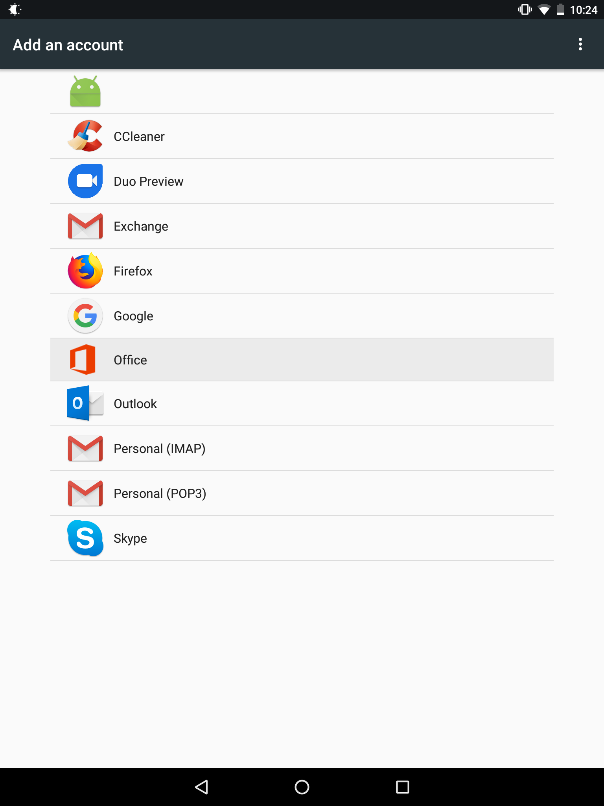
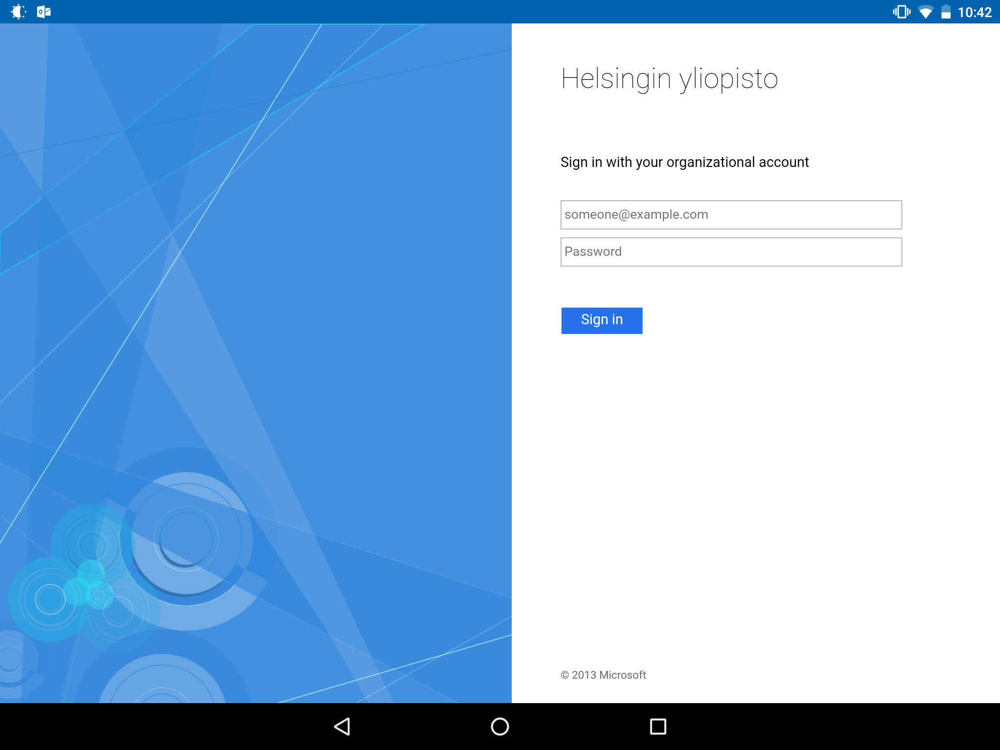
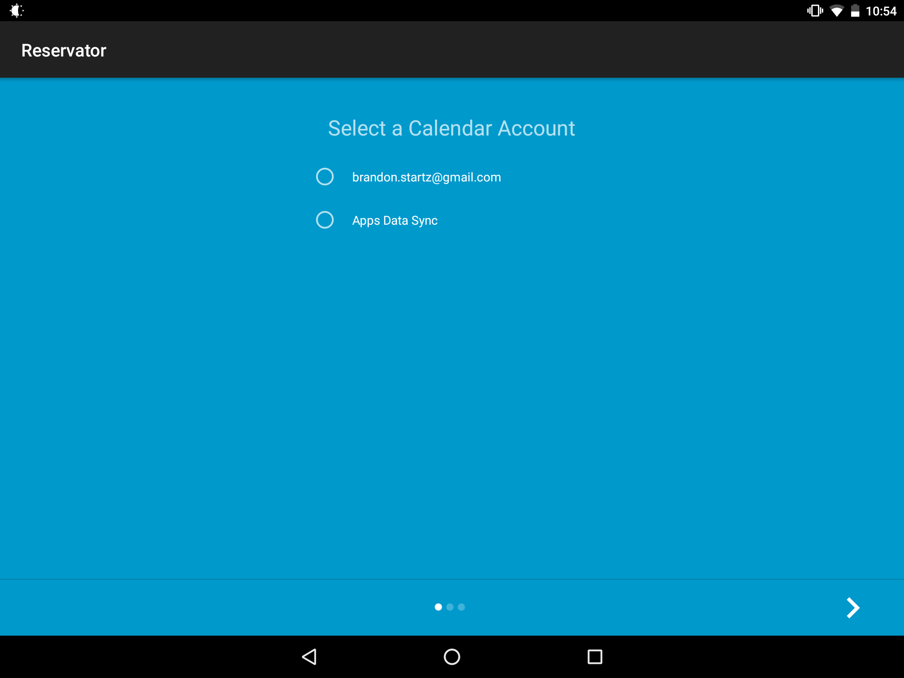

UbiKampus Reservator
==========

--Picture here

Description
-----------
UbiKampus Reservator[Name WIP] is an Android application for displaying and reserving meeting rooms, developed by Futurice and the University of Helsinki. 

UbiKampus Reservator[Name WIP] is a fork of the original Futurice Reservator at https://github.com/futurice/meeting-room-tablet. New features include support for Office365 calendars and a new UI. 

This application is meant for tablets so there are a few layout problems when using it on mobile phones.

How it works
-----------
The Reservator app does not directly communitate with cloud-based calendar services. Instead, it synchronizes itself with the Android Calendar App, which in turn takes care of the cloud-synchronization.

Installation
-----------

1. Configure the Android Calendar App to synchronize itself with the cloud-based calendar of your choice (Google calendar or Office365). In order to do this, go to Android Settings - Accounts and add your calendar account.
 

2. Using the Android Calendar App or the user interface of your cloud-based calendar, create a calendar for the meeting room you want to reserve with the Reservator app. Check that the events you create in the UI of your cloud-based calendar get synchronized in the Android calendar app.

3. Install the Reservator app. Upon first startup of the app, permission must be granted to allow access to contacts and calendar (both are required), then choose the calendar you created in step 2. As reservator is meant to be run in public spaces, there is no UI for changing this calendar selection after you have set it up. If you later want to switch the calendar, please uninstall the Reservator app, and re-install it.        
